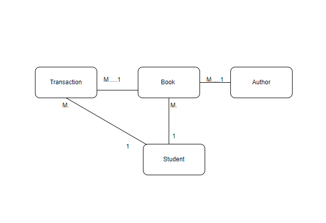

# Library management system 

##steps 
***
* visualize and find entities
* establish association 
  * IS-A - generalization (parent - child)
  * association 
    * aggragation (child can survive if a parent destroy) 
    * composition(child destroyed survive if a parent destroy)
* establish cardinality 
    * one to one 
    * one to many 
    * many to one 
    * many to many 
      * #####trick to find cardinality 
      * for two object A, and B 
        * ask object A, for 1 instance how many object B occur?
        * ask object B, for 1 instance how many object A occur?
      * example : student - book 
          * 1 student borrow one book
          * 1 book borrowed by many students (Many to one )
* indentify functionalities 
* API design 
* Implementation 
* Testing

### Major entities  
 ***
 * Author
 * Book 
 * Student 
 * Transaction 

### Functionalities 
  * Book 
    * create book (author part of book, create author if not exists)
    * find by ID, author, genere 
    * find all 
  * Student 
    * create student 
    * find student by Id 
    * find all students 
  * Transaction 
    * create issue book transaction with bookId and studentId
    * create return book transaction with bookId and studentId

 

 
